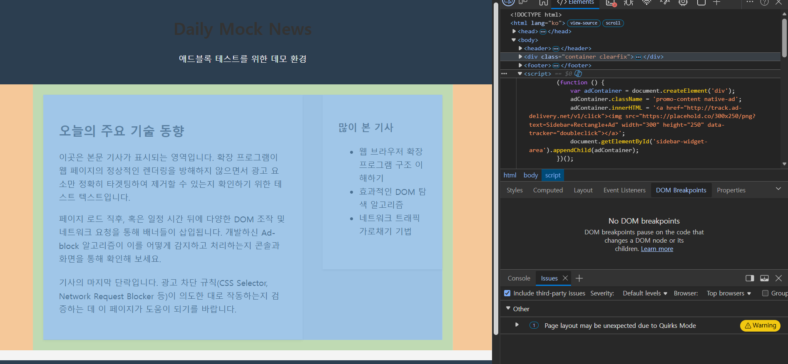

# ad-block-playground

## 개요

`ad-block-playground`는 브라우저 런타임에서 광고가 어떤 방식으로 탐지되고 제거되는지 이해하기 위해 만든 미니 실습 프로젝트입니다.

광고 복구(ad recovery)를 이해하려면 먼저 반대편 기술인 Ad Block이 어떤 기준으로 광고를 차단하는지 알아야 한다고 생각했습니다.

## 만든 이유

Ad Block으로 인해 차단된 광고 inventory와 dark traffic 문제를 더 잘 이해하기 위해 mock 광고 페이지를 만들고, 브라우저 DevTools를 통해 광고 surface를 분석한 뒤, 간단한 adblock simulation을 구현했습니다.

## 프로젝트 범위

주어진 시간(2시간) 내에서 기술을 구현하기 위해, 이번 프로젝트에서 다루는 내용과 다루지 않는 내용을 다음과 같이 정의했습니다.

먼저 이 프로젝트에서 다루는 내용은 다음과 같습니다.

- DevTools 기반 광고 surface 분석
- CSS selector 기반 cosmetic filtering
- URL / attribute keyword 기반 광고 탐지
- `MutationObserver`를 이용한 런타임 DOM 변화 감지

이 프로젝트에서 다루지 않는 내용은 다음과 같습니다.

- 실제 브라우저 확장 프로그램 구현
- 실제 네트워크 요청 차단
- production-level filter list parser
- 실제 광고 복구 로직

## 트러블 슈팅 과정

프로젝트를 진행하며 큰 문제점은 없었지만, ad blocker를 구현하며 다음과 같은 어려움이 있었고, 이렇게 해결했습니다.

1. 매우 단순한 adblocker를 구현하기 위해서는 단순히 DOM 셀렉터를 이용해 접근하면 됐습니다. 하지만 이렇게 구현하면 다른 웹사이트나 웹사이트가 변경되었을 때 적용하지 못하는 일회성이자 실제로 적용하기 어려운 솔루션이라고 판단하여, general한 task로 풀기로 하였고, keyword 기반 필터링을 적용했습니다.
2. 초기 적용한 팝업 광고를 지우기 위한 MutationObserver가 동작하지 않았습니다. 확인 결과, MutationObserver는 DOM 변화를 감지하여 ads keyword가 존재할 때 제거하는 방식이었는데, 팝업 광고 div는 ads keyword를 포함하지 않았습니다. 따라서 최대한 general하게 팝업 광고를 tracking하기 위해 iframe + z-index 1000 이상을 팝업 signal로 판단하고 적용했습니다.

## 회고

이 프로젝트를 통해 Ad Block이 단순히 화면에 보이는 광고 이미지를 지우는 문제가 아니라는 점을 이해했습니다.

광고 차단은 URL 패턴, DOM 구조, CSS selector, element attribute, runtime DOM mutation 등 브라우저 런타임에서 드러나는 여러 signal을 조합해 판단하는 문제였습니다.

최대한 주어진 환경에서 general한 task를 수행하는 adblocker를 구현하고자 하였고, 그 결과 keyword 기반 필터링이 해당 모의 사이트가 확장되었을 때나 다른 사이트에서도 적용 가능한 최대 효율 기법이라고 생각하여 적용했습니다.

이를 통해 Ad Recovery 역시 단순히 광고를 다시 노출하는 문제가 아니라, 광고 차단기가 어떤 surface를 보고 차단하는지 이해한 뒤 접근해야 하는 브라우저 런타임 문제라는 점을 알게 되었습니다.

## 실행 방법

`index.html`을 열면 광고가 포함된 원본 mock 페이지를 확인할 수 있습니다.

`blocked.html`을 열면 `adblock.js`가 적용되어 광고가 제거된 페이지를 확인할 수 있습니다.

브라우저 console에서 어떤 요소가 제거되었는지 확인할 수 있습니다.